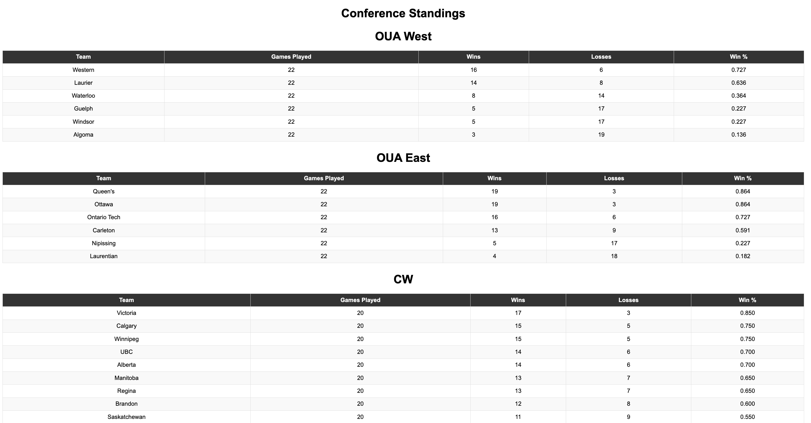
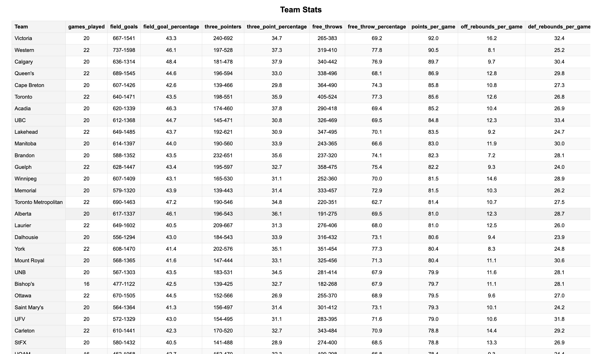
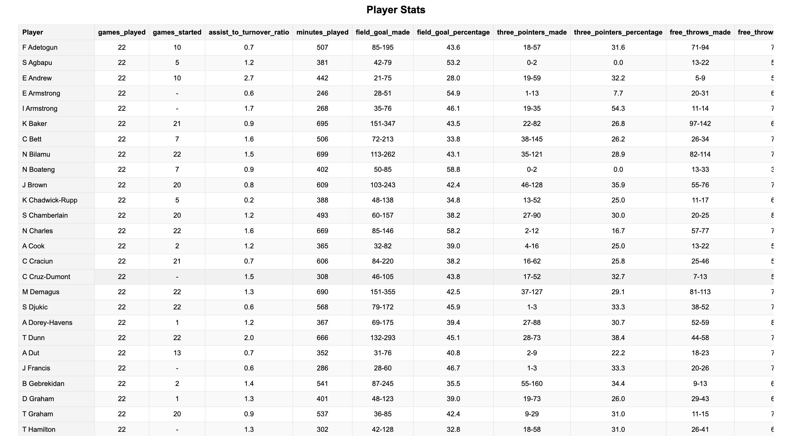

# U Sports React Webapp

## Description

The **U Sports React Webapp** is a dynamic web application developed using React.js that allows users to access and visualize detailed basketball statistics from the U Sports website. The application enables users to select between men's and women's basketball data, view team and player statistics, and explore conference standings.

## Technologies Used

- **React.js**: Frontend library for building user interfaces.
- **JavaScript**: Programming language for application logic.
- **CSS**: Styling language for application layout and design.
- **Playwright**: Web scraping library used to extract basketball statistics.


## Current Stat Groups

### Conference Standings
This section covers all 6 conferences in U Sports basketball, ranking teams from best to worst for each league (Men's or Women's).

<div style="text-align: center;">
    
</div>


### Team Stats
This section covers all 56 teams from the men's and women's in U Sports basketball, tracking a total of 40 performance statistics for each team. The data includes various metrics that facilitate in-depth analysis and comparisons across teams.

<div style="text-align: center;">
    
</div>


### Player Stats
This section covers all 550+ players from both the men's and women's in U Sports basketball, tracking a total of 22 performance statistics for each player. The data includes various metrics that facilitate in-depth analysis and comparisons across teams.

<div style="text-align: center;">
    
</div>


## Contributing

Contributions are welcome! If you have suggestions for improvements, please fork the repository and create a pull request.


## Installation

To run this project locally, follow these steps:

1. Clone the repository:
   ```bash
   git clone https://github.com/yourusername/usports-react-webapp.git
2. Navigate into the project directory:
   ```bash
   cd usports-react-webapp
3. Install the necessary dependencies:
   ```bash
   npm install
4. Start the development server:
   ```bash
   npm start
5. Open your browser and go to http://localhost:3000 to view the application.


## Usage
- Once in the application, select the desired league (Men’s or Women’s) on the welcome page.
- Choose whether to view Teams or Players on the category page.
- View Conference Standings, Team Stats, or Player Stats based on your selection.

## Acknowledgments
Thank you for taking the time to read this README! Your interest in this project is greatly appreciated. If you have any questions or feedback, feel free to reach out.
